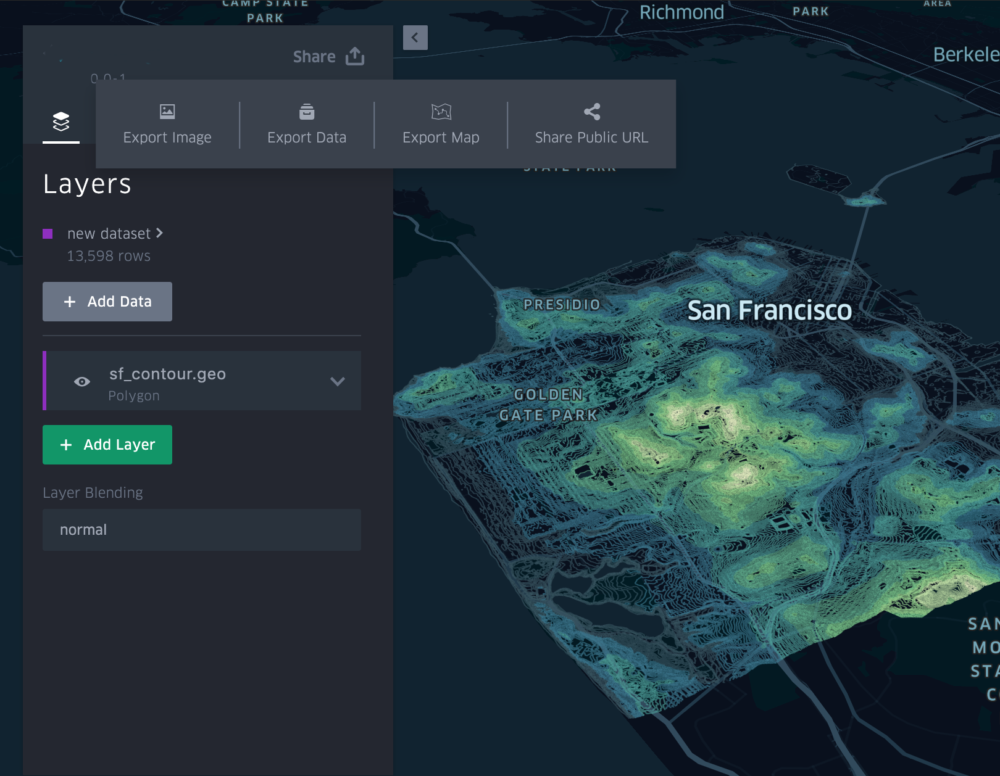
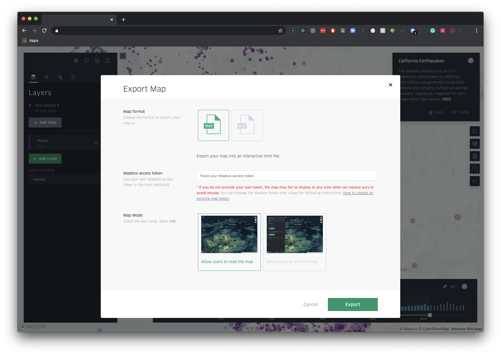

# Save and Export



Napkin Visual is a client-side only application. In the demo app, the data you uploaded stays in your browser. Uber does not send or store any user data to any backends. This rule poses an limitation on how you can save and share your maps.

However, in the demo app, you can:

- [Export map as an image](#export-image).
- [Export filtered or unfiltered data as a csv](#export-data).
- [Export Map](#export-map)
- [Share Public URL (Dropbox)](#export-dropbox)

## <a href="#export-image">Export Image</a>


You can export the current map as an image. The export window will use the current map viewport, and the preview will show the entire exported map area. To adjust the viewport, you will have to close the export dialog. You can choose different export ratios or resolutions, and also to add a map legend.

## <a href="#export-data">Export Data</a>


You can export map data as a csv file, with the option to export ONLY the filtered data or the entire dataset.

## <a href="#export-map">Export Map</a>
You can export the current map using two different formats. The __Export Map__ window provides two options:
- HTML: create a single html file loads and renders your current map.
- JSON: create a json file with your current map config and data.

### <a href="#export-html-map">Export Map as HTML</a>



To save and export your current map as HTML file, click on __Export Map__ and subsequently on __Export__.
When prompted provide your own mapbox token to be used in the newly generated file. If you don't provide a Mapbox Token,
Napkin Visual will use a default one which can expire at anytime without any communication and therefore break your your existing map.

#### How to update an exported map token
In order to edit the mapbox token in your html file you simply need to perform the following steps:
1. [Create a new mapbox token](https://docs.mapbox.com/help/how-mapbox-works/access-tokens/) or use your existing one.
2. Open the Napkin Visual map file with your favorite text editor.
3. Locate the following line in the exported file __kepler.gl.html__:
```javascript
  /**
   * Provide your MapBox Token
   **/
  const MAPBOX_TOKEN = 'CURRENT_TOKEN';
```
4. Replace the current value a new valid token. The code should now look like the following:
```javascript
  /**
   * Provide your MapBox Token
   **/
  const MAPBOX_TOKEN = 'pk.eyJ1IjoidWJlcmRh...';
```

### <a href="#export-json-map">Export Map as JSON</a>


You can export the current map as a `json` file. This is useful when you are running your own Napkin Visual application and want to load your map programmatticaly.
The JSON file includes:
- dataset: processed data to create used to render your map
- config: layer, filter, map style and interaction settings.
The map config includes the current layer, filter, map style and interaction settings.

**Note:** Napkin Visual map config is coupled with loaded datasets. The __`dataId`__ key is used to bind layers, filters and tooltip settings to a specific dataset. If you try to upload a configuration with a dataset in your own Napkin Visual app, you also need to make sure your dataset __`id`__ matches the __`dataId`__ in the config.


## <a href="#export-dropbox">Share Public URL (Dropbox) </a>


To export the current map into your Dropbox account, click on __Share Public Url__ and select Dropbox as your cloud storage.
Perform the authentication against Dropbox using your credentials. Once the authentication process is completed,
click on __Upload__ and Napkin Visual will push your current map onto your account.

At the end of the process Napkin Visual will automatically generate a permalink for your work you can share with other users.

[Back to table of contents](README.md)
